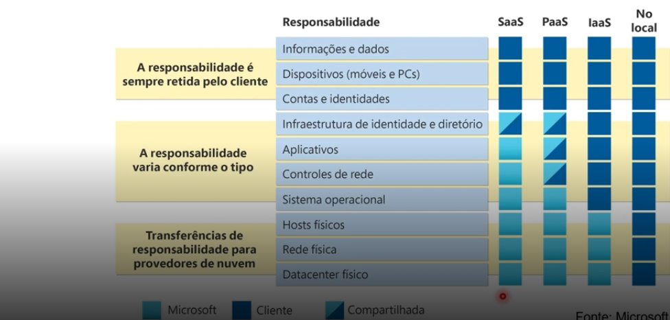
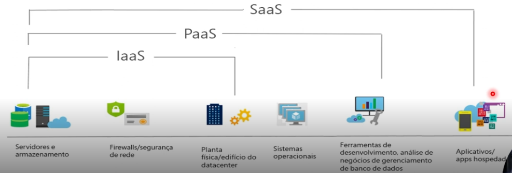
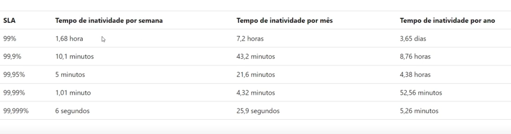

# *Dio*

# Resumo Azure 🚀

> Breve descrição e oquê o projeto faz.

---

## 📝 Descrição
Uma explicação resumida dos conceitos adiquiridos sobre Azure.

## 📌 O que é Azure?
O Azure é a plataforma de computação em nuvem da Microsoft, oferecendo centenas de serviços para construir, rodar e gerenciar aplicações em várias nuvens, on-premises.

## 💡 Conceitos Relevantes
- **SLA (Service Level Agreement):** Compromisso de disponibilidade.
- **Escalabilidade:** Capacidade de aumentar recursos (Vertical ou Horizontal).
- **Modelo de Responsabilidade Compartilhada:** O que a Microsoft cuida vs. o que VOCÊ cuida.

### 🖥️ Prints
Confira abaixo:

---
*Repositório para fins educacionais.*